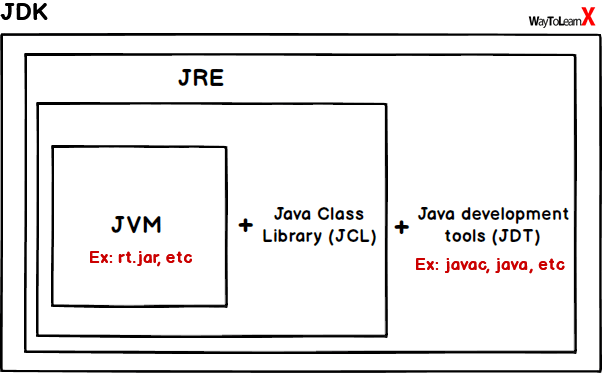

# Tools : ECLIPSE , MAVEN , Junit , Apache TomCat
## Eclipse:

Eclipse IDE is an integrated development environment (IDE) . It is one of the most popular and widely used Java IDEs, known for its robust performance, extensive plugin ecosystem, and comprehensive tools for Java development. Eclipse is an open-source project under the Eclipse Foundation and supports not just Java development, but also a variety of other programming languages through plugins.

*Key features of Eclipse IDE for Java include:*

1. Java Development Tools (JDT): Eclipse comes with a set of powerful tools for Java development, including a source code editor with syntax highlighting, code completion, refactoring capabilities, and a debugger.

2. Plugin Ecosystem: Eclipse has a vast ecosystem of plugins that extend its functionality beyond Java to other languages and frameworks, such as C/C++, PHP, JavaScript, and more. This allows developers to use Eclipse as a multi-language development environment.

3. Integrated Build Tools: It integrates with build and project management tools like Maven and Gradle, making it easy to manage dependencies, build processes, and project lifecycles within the IDE.

4. Version Control Integration: Eclipse supports integration with various version control systems, including Git and SVN, facilitating source code management directly from the IDE.

5. Graphical User Interface (GUI) Builder: For Java developers working on Swing or SWT-based GUI applications, Eclipse provides tools and editors to design graphical interfaces visually.

6. Rich Client Platform (RCP): Eclipse can be used for developing general-purpose applications through its Rich Client Platform, which provides a modular architecture and a set of core components for building rich, client-side applications.

7. Extensive Documentation and Community Support: As a widely used open-source project, Eclipse has a large and active community, offering extensive documentation, forums, and tutorials to help solve development challenges and improve skills.

*Eclipse IDE is not limited to just Java development; it offers a range of distributions tailored to different kinds of development needs:*

**Eclipse IDE for Java Developers
**Eclipse IDE for C/C++ Developers (CDT)
**Eclipse for PHP Developers
**Eclipse IDE for JavaScript and Web Developers
**Eclipse IDE for RCP and RAP Developers
**Eclipse IDE for Scout Developers
**Eclipse IDE for Rust Developers
**Eclipse IDE for Java EE Developers: Targeted at developers building Java Enterprise Edition (EE) applications, this package contains everything in the Java Developers package, plus tools for Java EE, JPA, JSF, Mylyn, XML, and Web services development.

## JDK 
Java Development Kit (JDK): The JDK is a full-featured software development kit for Java, including everything needed to develop Java applications and applets. It includes the Java compiler (javac), the Java Runtime Environment (JRE), an interpreter/loader (java), an archiver (jar), a documentation generator (Javadoc), and other tools needed for Java development. Essentially, the JDK is a superset of the JRE and is intended for Java developers.

## Maven
## Junit 
## Containers
## Apache Tomcat 
