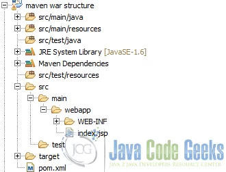

# Tools : ECLIPSE , MAVEN , Junit , Apache TomCat
## Eclipse:

Eclipse IDE is an integrated development environment (IDE) . It is one of the most popular and widely used Java IDEs, known for its robust performance, extensive plugin ecosystem, and comprehensive tools for Java development. Eclipse is an open-source project under the Eclipse Foundation and supports not just Java development, but also a variety of other programming languages through plugins.

*Key features of Eclipse IDE for Java include:*

1. Java Development Tools (JDT): Eclipse comes with a set of powerful tools for Java development, including a source code editor with syntax highlighting, code completion, refactoring capabilities, and a debugger.

2. Plugin Ecosystem: Eclipse has a vast ecosystem of plugins that extend its functionality beyond Java to other languages and frameworks, such as C/C++, PHP, JavaScript, and more. This allows developers to use Eclipse as a multi-language development environment.

3. Integrated Build Tools: It integrates with build and project management tools like Maven and Gradle, making it easy to manage dependencies, build processes, and project lifecycles within the IDE.

4. Version Control Integration: Eclipse supports integration with various version control systems, including Git and SVN, facilitating source code management directly from the IDE.

5. Graphical User Interface (GUI) Builder: For Java developers working on Swing or SWT-based GUI applications, Eclipse provides tools and editors to design graphical interfaces visually.

6. Rich Client Platform (RCP): Eclipse can be used for developing general-purpose applications through its Rich Client Platform, which provides a modular architecture and a set of core components for building rich, client-side applications.

7. Extensive Documentation and Community Support: As a widely used open-source project, Eclipse has a large and active community, offering extensive documentation, forums, and tutorials to help solve development challenges and improve skills.

*Eclipse IDE is not limited to just Java development; it offers a range of distributions tailored to different kinds of development needs:*

* Eclipse IDE for Java Developers
* Eclipse IDE for C/C++ Developers (CDT)
* Eclipse for PHP Developers
* Eclipse IDE for JavaScript and Web Developers
* Eclipse IDE for RCP and RAP Developers
* Eclipse IDE for Scout Developers
* Eclipse IDE for Rust Developers
* Eclipse IDE for Java EE Developers: Targeted at developers building Java Enterprise Edition (EE) applications, this package contains everything in the Java Developers package, plus tools for Java EE, JPA, JSF, Mylyn, XML, and Web services development.

## JDK 
Java Development Kit (JDK): The JDK is a full-featured software development kit for Java, including everything needed to develop Java applications and applets. It includes the Java compiler (javac), the Java Runtime Environment (JRE), an interpreter/loader (java), an archiver (jar), a documentation generator (Javadoc), and other tools needed for Java development. Essentially, the JDK is a superset of the JRE and is intended for Java developers.

## Maven
Apache Maven is a powerful project management and comprehension tool primarily used for Java projects. Maven utilizes a Project Object Model (POM), which is defined in an XML file (pom.xml), to manage project dependencies, plugins, goals, and configurations. It simplifies the build process like compiling code, packaging binaries, and managing documentation and dependencies.

Maven's core feature is its *dependency management system*. It automatically downloads libraries and plugins required by your project from the central Maven repository, eliminating the need to manually manage JAR files and other dependencies.

###### Maven's Utility
1. Project Standardization 
2. Dependency Management: It automatically handles the inclusion and updating of dependencies, reducing the risk of  conflicts and missing libraries.
3. Build Automation: Maven automates the build process, including compiling code, running tests, packaging applications, and generating reports.
4. Plugin Ecosystem
###### Key Elements of a POM File

*     <modelVersion>: Specifies the version of the object model Maven uses. This is always 4.0.0 for current versions of Maven.
*     <groupId>: Defines the id of the project's group. This is generally unique among an organization or a project. It's often used to structure the package name.
*     <artifactId>: The id of the artifact (project) itself. This is the name of the JAR without version if the project is packaged as a JAR.
*     <version>: The version of the artifact under the specified group.
*     <packaging>: Defines how the project should be packaged. Common types include jar, war, and ear. The default is jar.
*     <dependencies>: Lists the dependencies required by the project. Each dependency is specified by its groupId, artifactId, and version. Maven automatically downloads these from the central repository or from other specified repositories.
*     <build>: Contains build-related information, including plugins and other elements used during the build process.
*     <plugins>: Within the <build> section, this element contains plugins that extend the capabilities of Maven, such as compiling code, running tests, creating JAR files, 

###### Maven for JEE 
For Java EE (Enterprise Edition) projects, Maven can manage dependencies such as servlet APIs, EJBs (Enterprise JavaBeans), and JPA (Java Persistence API) implementations. Here's a simplified example of how you might set up a Maven

 

## Junit 
JUnit is a popular framework for unit testing in Java. Maven can manage JUnit dependencies and run tests as part of the build lifecycle. Here's how you might include JUnit in your pom.xml:
 
 ###### Ex :for  adding Junit 4 to pom.xml
        <dependencies>
            <!-- JUnit dependency -->
            <dependency>
                <groupId>junit</groupId>
                <artifactId>junit</artifactId>
                <version>4.13.2</version> <!-- Specify the desired JUnit version -->
                <scope>test</scope> <!-- Indicates dependency is only for testing -->
            </dependency>
            <!-- Other dependencies here -->
        </dependencies>

## Containers
## Apache Tomcat  

# The folder "FirstApp_Java_simple_archetype" 
this folder contains a simple JAVA porject with maven , it's a simple archetype for testing Junit , where i've written a class "operation" and a test class "operationTest" where we find methodes for testing  