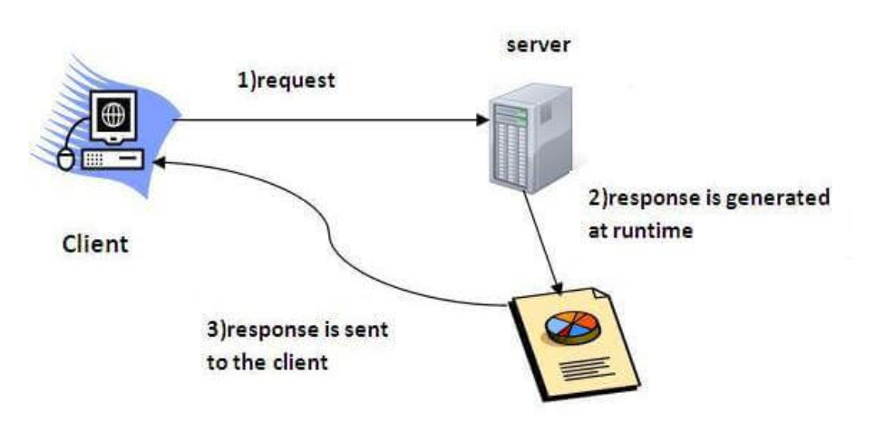
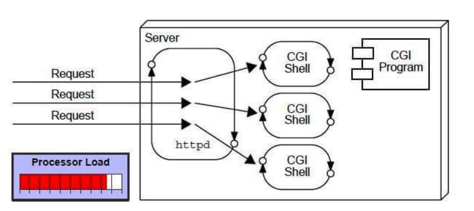
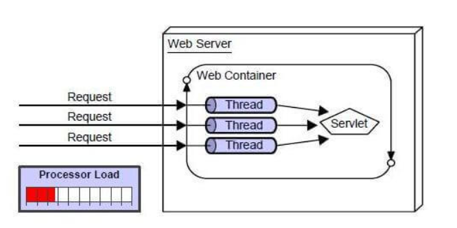

# Servlet :
## What is a servlet : 
Servlets are Java programs that run on a server and handle requests and responses in a web application. They are the building blocks of web applications in Java EE, allowing for the dynamic generation of content in response to requests.

But before  all this , 
## What is a web app ?
A web application is an application accessible from the web. A web application is composed of web components like (in JEE) Servlet, JSP, Filter, etc. and other elements such as HTML, CSS, and JavaScript. The web components typically execute in Web Server and respond to the HTTP request.
## What is CGI (Common Gateway Interface) ? 
CGI technology enables the web server to call an external program and pass HTTP request information to the external program to process the request. For each request, it starts a new process.

CGI (Common Gateway Interface) and Java Servlets are both technologies that enable the generation of dynamic web content. Both are used for server-side computing, but they have significant differences in their approach, capabilities, and performance. Here's a comparison of CGI and Servlets:

## Servlet VS CGI ? advantages and disadvantages
Both CGI (Common Gateway Interface) and Java Servlets have their advantages and disadvantages, which can affect their suitability for different web application scenarios.

### CGI Advantages:
1. Language Flexibility: CGI can be written in almost any programming language, providing a lot of flexibility.
2. Simplicity: Writing a simple CGI script can be quick and straightforward, especially for small tasks.
3. Isolation: Each request runs in its own process, so crashes in one script do not affect others.
4. Maturity: CGI is a mature standard and is supported by virtually all web servers.
### CGI Disadvantages:
1. Performance: CGI scripts are slow compared to Servlets because a new process is created for each HTTP request.
2. Resource Intensive: The overhead of creating and destroying processes for each request consumes more system resources.
3. Scalability: Due to its process model, CGI doesn't scale well for high-traffic sites.
4. State Management: CGI doesn't inherently support session tracking, making it harder to maintain state between requests.

### Servlet Advantages:

1. Performance: Servlets are more efficient than CGI scripts because they run within the web server's process. There is no need to start a new process for each request.
2. Scalability: Servlets can handle a large number of requests with less overhead, making them more scalable.
3. Extensibility: Java's rich ecosystem allows Servlets to leverage an extensive range of libraries and frameworks.
4. State Management: Servlets support session tracking natively, which simplifies the management of stateful interactions.
5. Integration: Being part of the Java ecosystem, Servlets integrate smoothly with other Java EE technologies.
6. Portability: Java code is platform-independent, which makes Servlets portable across different operating systems and server platforms.
### Servlet Disadvantages:

1. Language Constraint: Servlets can only be written in Java, which may not be preferred by all developers.
2. Complexity: Setting up a Servlet and the environment it requires can be more complex than a simple CGI script.
3. Development Overhead: Writing Servlets involves more boilerplate and requires a deeper understanding of the Java ecosystem.
4. Runtime Environment: Servlets require a Java runtime and a servlet container, which can be more resource-intensive to maintain than the lightweight servers typically used for CGI.

In summary, while CGI scripts are simple and flexible, they are not efficient for high-load scenarios. Servlets, on the other hand, offer better performance and scalability but require a commitment to the Java language and environment. The choice between CGI and Servlets will depend on the specific requirements of the project, the expected traffic, the existing infrastructure, and the development team's expertise.